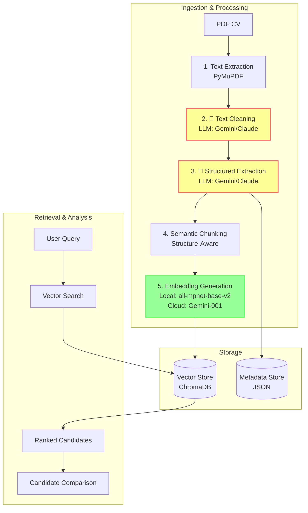

# CV Screening System: Complete Technical Documentation

## 1. System Overview

This system is an advanced RAG (Retrieval Augmented Generation) pipeline designed to automate the screening of Curriculum Vitae (CVs). It transforms unstructured PDF resumes into a structured, searchable database, enabling recruiters to find candidates using natural language queries (e.g., "Senior Python Developer with 5 years of ML experience") with high precision.

### Key Features
- **Universal Ingestion**: Handles PDFs of any format or language.
- **AI-Powered Cleaning**: Uses LLMs (Gemini/Claude) to normalize text and fix formatting artifacts.
- **Structured Extraction**: Extracts 20+ fields (skills, experience, education) into JSON.
- **Semantic Chunking**: Intelligent chunking based on document structure, not just token counts.
- **Dual Embedding Support**: Supports both local (free, private) and API-based (Gemini) embeddings.
- **Semantic Search**: Vector-based retrieval that understands context and synonyms.

---

## 2. System Architecture

### High-Level Data Flow

---

## 3. Pipeline Steps Detailed

### Step 1: Text Extraction
**Module**: `extract_text.py`
- **Tool**: PyMuPDF (`fitz`)
- **Function**: Extracts raw text from PDF files. Preserves physical layout but often results in "messy" text (e.g., "W O R K  E X P E R I E N C E").

### Step 2: Text Cleaning
**Module**: `text_cleaner.py`
- **Tool**: LLM (Gemini/Claude) + Regex
- **Function**: Normalizes text to ensure high-quality embeddings.
- **Process**:
    1.  **Rule-based**: Fixes common issues like spaced letters and unicode artifacts.
    2.  **LLM-based**: Rewrites the text to standardize headers and fix broken sentences while preserving all factual information.

### Step 3: Structured Extraction
**Module**: `cv_extractor.py`
- **Tool**: LLM (Gemini/Claude)
- **Function**: Converts unstructured text into a strict `CVData` schema.
- **Extracted Fields**:
    -   **Identity**: Name, Email, Phone, LinkedIn.
    -   **Experience**: Total years, Current Role, Companies, Roles.
    -   **Skills**: Technical Skills, Languages, Frameworks, Tools.
    -   **Education**: Degrees, Universities, Years.

### Step 4: Semantic Chunking
**Module**: `semantic_chunking.py`
- **Strategy**: Structure-Aware Chunking (See Section 4).
- **Function**: Converts the `CVData` object into meaningful text chunks for embedding.
- **Note on `chunking.py`**: The file `chunking.py` defines the `TextChunk` data structure used throughout the system. It also contains a standard sliding-window chunking implementation (`chunk_text`), but this is **not used** in the main pipeline (`batch_processor.py`), which relies exclusively on `semantic_chunking.py`.

### Step 5: Embedding Generation
**Module**: `embedding.py`
- **Tool**: `sentence-transformers` (Local) or Google GenAI (Cloud).
- **Default Model**: `all-mpnet-base-v2` (Local).
    -   **Dimensions**: 768
    -   **Performance**: State-of-the-art for semantic search.
- **Alternative**: `all-MiniLM-L6-v2` (Faster, lower quality).

### Step 6: Storage
- **Vector Store**: `vector_store.py` uses **ChromaDB** to store embeddings and metadata for fast similarity search.
- **Metadata Store**: `metadata_store.py` maintains a JSON registry of all processed candidates for structured filtering.

---

## 4. Semantic Chunking Strategy

Our system employs a **Structure-Aware Semantic Chunking** strategy (`semantic_chunking.py`) rather than arbitrary token splitting. This ensures that retrieved chunks are always semantically complete.

### Chunk Types

1.  **Contact & Summary Chunk**:
    -   Contains Name, Contact Info, Current Role, and Total Experience.
    -   *Purpose*: Quick identification and high-level filtering.

2.  **Work Experience Summary**:
    -   Aggregates all companies and roles into a single narrative.
    -   *Purpose*: Matching career trajectory and employer history.

3.  **Contextual Technical Profile (The "Super Chunk")**:
    -   **Innovation**: Artificially constructs a narrative tying skills to experience levels.
    -   **Content**: Combines Current Role + Years of Experience + Clustered Skills (ML/Data/Web) + Education + Top Companies.
    -   *Benefit*: Creates a dense vector where "Python" is mathematically associated with "Senior" and "7 years experience".

4.  **Specific Skill Chunks**:
    -   Dedicated chunks for **Programming Languages**, **Frameworks**, and **Tools**.
    -   *Purpose*: High-precision matching for specific tech stack queries.

5.  **Education Chunk**:
    -   Detailed degree and university information.

---

## 5. Search & Retrieval

### Semantic Search
**Script**: `search_cvs.py`
- **Mechanism**: Cosine similarity search in ChromaDB.
- **Process**:
    1.  Embeds the user query (e.g., "Machine Learning Engineer").
    2.  Retrieves the top `k` most similar chunks from the database.
    3.  **Aggregation**: Groups chunks by candidate.
    4.  **Ranking**: Ranks candidates based on their *best matching chunk* score.
    5.  **Display**: Shows the candidate name, match score, and the specific text snippet that triggered the match.

### Hybrid Search (Planned)
While currently focused on semantic search, the architecture supports **Hybrid Search**:
-   **Step 1**: Filter candidates using the Metadata Store (e.g., `experience >= 5`).
-   **Step 2**: Perform semantic search only on the filtered subset.
-   This combines the precision of structured data with the flexibility of vector search.

---

## 6. Technical Configuration

Configuration is managed via `.env` and `config.py`.

### Key Environment Variables

| Variable | Default | Description |
| :--- | :--- | :--- |
| `LLM_PROVIDER` | `gemini` | Choice of LLM: `gemini` or `claude`. |
| `GEMINI_API_KEY` | - | Required if using Gemini. |
| `EMBEDDING_PROVIDER` | `local` | `local` (free) or `gemini` (paid). |
| `LOCAL_EMBEDDING_MODEL` | `all-mpnet-base-v2` | The local model to use. |
| `CHUNK_SIZE` | `512` | Max tokens per chunk (for standard chunking). |
| `RETRIEVAL_TOP_K` | `5` | Number of chunks to retrieve per search. |

---

## 7. Theoretical Foundations

### Why RAG for CVs?

1.  **Context Window Limits**: Even 128k context windows cannot fit hundreds of CVs effectively. RAG scales to millions of CVs by retrieving only what's relevant.
2.  **"Lost in the Middle"**: LLMs struggle to recall information from the middle of long prompts. RAG feeds the LLM only the specific, relevant snippets.
3.  **Cost Efficiency**: Instead of re-reading every CV for every query (expensive), we embed them once (cheap) and search mathematically (near-zero cost).

### Performance Metrics

-   **Processing Time**: ~5-10 seconds per CV (dominated by LLM extraction).
-   **Search Time**: < 100ms for vector search.
-   **Accuracy**: Semantic chunking significantly outperforms standard chunking by preserving the context (experience/seniority) associated with skills.
